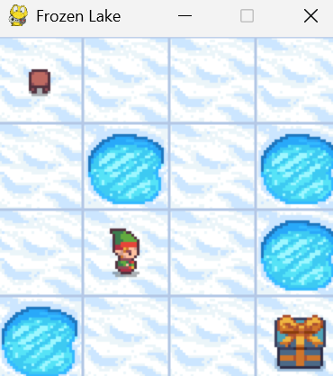
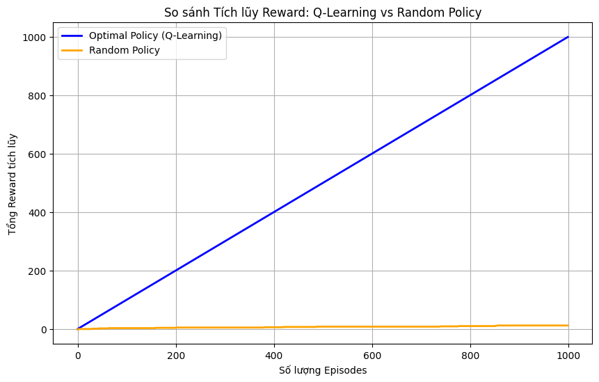
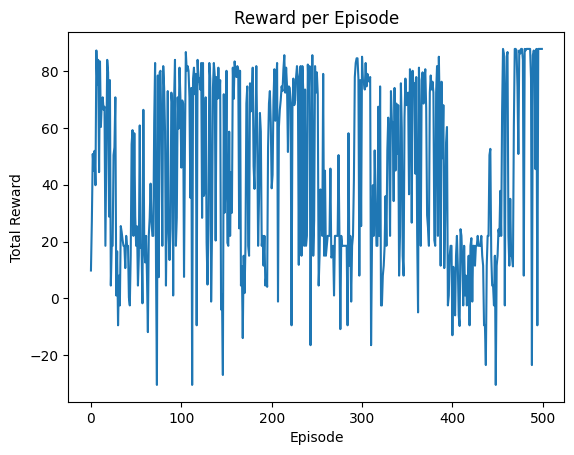
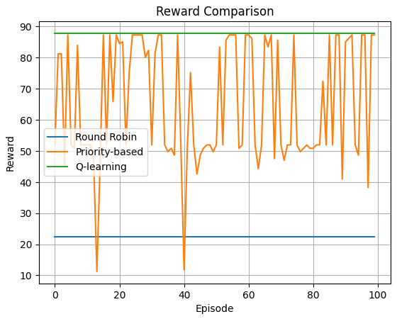
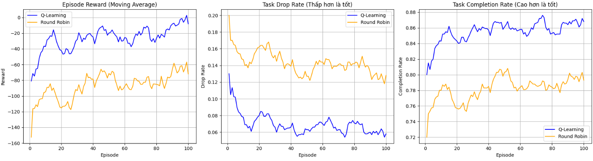

# Lab 02 - Q-Learning

Repository này chứa bài thực hành Lab 02 về thuật toán Q-learning, gồm 3 phần bài tập chính và các file kết quả được sinh ra trong quá trình chạy notebook.

## Nội dung chính

- **Part 1 - FrozenLake**: hiện thực Q-learning trên môi trường `FrozenLake-v1`, so sánh với chính sách `Random`.
- **Part 2 - VacuumCleaner**: xây dựng môi trường `VacuumCleaner` tùy biến, huấn luyện Q-learning và so sánh với `Round Robin`, `Priority-based`.
- **Part 3 - Load Balancing**: áp dụng Q-learning cho bài toán cân bằng tải và so sánh với `Round Robin`.

## Cấu trúc thư mục

- `Lab2.ipynb`: notebook tổng hợp 3 phần bài làm.
- `notebooks/part_01_frozen_lake.ipynb`: notebook riêng cho Part 1.
- `notebooks/part_02_vacuum_cleaner.ipynb`: notebook riêng cho Part 2.
- `notebooks/part_03_load_balancing.ipynb`: notebook riêng cho Part 3.
- `metrics/`: các file CSV kết quả của Part 2 và Part 3.
- `pictures/`: các ảnh minh họa kết quả.
- `report/`: báo cáo bài làm.
- `requirements.txt`: danh sách thư viện cần cài đặt.

## Cài đặt

Cài các thư viện cần thiết:

```bash
pip install -r requirements.txt
```

## Cách chạy

Có thể chạy theo một trong hai cách:

1. Mở `Lab2.ipynb` để chạy toàn bộ bài trong một notebook.
2. Mở từng notebook trong thư mục `notebooks/` để chạy riêng từng phần:
   - `part_01_frozen_lake.ipynb`
   - `part_02_vacuum_cleaner.ipynb`
   - `part_03_load_balancing.ipynb`

Lưu ý:

- Với **Part 1**, nếu gặp vấn đề ở phần render `Pygame`, có thể tạm bỏ qua cell `human render` và chỉ dùng phần text output.
- Với **Part 2** và **Part 3**, các file CSV sẽ được lưu trong thư mục `metrics/`.

## Kết quả đầu ra

Một số file kết quả chính:

- `metrics/part_02_comparison_rewards.csv`
- `metrics/q_learning_metrics.csv`
- `metrics/round_robin_metrics.csv`
- `metrics/summary_metrics.csv`
- `notebooks/q_table_final.txt`

## Hình minh họa

### Part 1 - FrozenLake





### Part 2 - VacuumCleaner





### Part 3 - Load Balancing



## Báo cáo

Xem báo cáo đầy đủ tại đây: 👉 [Nhom07-Lab02_23521147_23520797_23521162.pdf](report/Nhom07-Lab02_23521147_23520797_23521162.pdf)

## Ghi chú

- `Lab2.ipynb` đã được ghép từ 3 notebook riêng để thuận tiện cho việc nộp bài.
- Các notebook riêng vẫn được giữ lại để dễ kiểm tra và chỉnh sửa từng phần.
